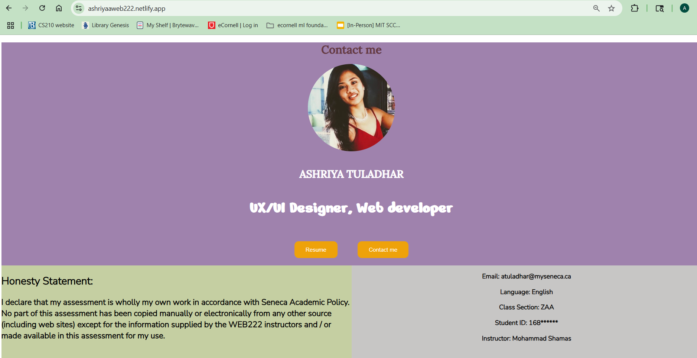

# WEB222 Project- Personal Portfolio Website

## 📝 Project Description
A responsive personal portfolio website created as the final assessment for WEB222 course at Seneca College. Showcases professional information, education background, skills, and includes an interactive contact form.

## ✨ Key Features
### Responsive Design
- Adapts seamlessly to all screen sizes
- Mobile-friendly layout

### Interactive Elements
- **Downloadable Resume**: One-click PDF download
- **Smart Contact Form**:
  - Field validation (required fields, email format)
  - Canadian postal code validation (A1A1A1 or A1A 1A1 formats)
  - Dynamic textarea that appears when "Other" is selected

### Content Sections
- Professional profile with photo
- Academic honesty declaration
- Education timeline
- Skills showcase with visual styling
- Fully functional contact form

## 💻 Technologies Used
- **Frontend**: HTML5, CSS3, JavaScript
- **Fonts**: Google Fonts (Nunito Sans, Nerko One, Roboto Mono, Lora)
- **Deployment**: Netlify

## 🚀 Live Demo
👉 [View Live Portfolio](https://ashriyaaweb222.netlify.app/)

## 🛠️ Project Structure
- `index.html` - Main HTML file
- `index.css` - Stylesheet
- `index.js` - JavaScript for form validation and dynamic elements
- `imgs/` - Folder containing profile image
- `pdf/` - Folder containing resume PDF Write this for readme
